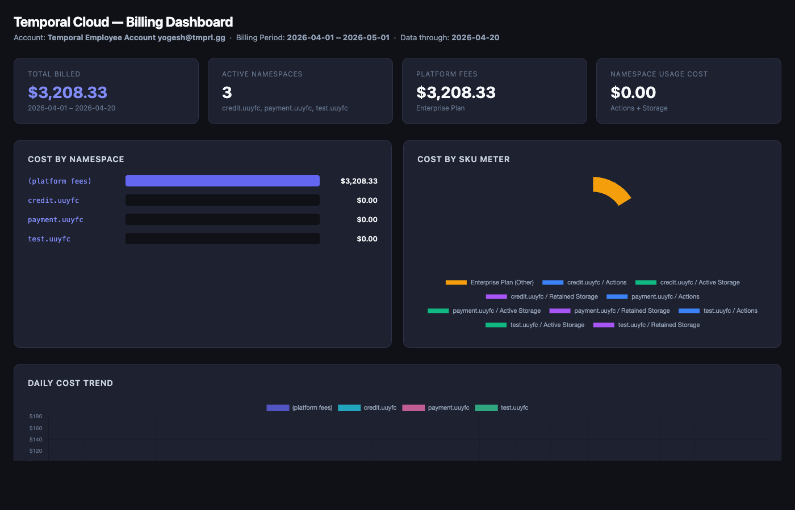

# Billing API

Fetches a Temporal Cloud billing report via the Cloud Operations API, saves it as CSV to `_output/`, generates an HTML dashboard, and opens it in your browser — all in one command.

> **Permissions required:** your API key must belong to an account with **Finance Admin** or **Account Owner** role.
> See the [Temporal Cloud Billing API docs](https://docs.temporal.io/cloud/billing-api) for details.

## Setup

```bash
python3 -m venv venv
source venv/bin/activate
pip install -r requirements.txt
```

## Usage

```bash
TEMPORAL_CLOUD_API_KEY=<your-key> python billing_api.py
```

Filter to a single namespace:

```bash
TEMPORAL_CLOUD_API_KEY=<your-key> python billing_api.py --namespace my-namespace
```

## What it does

1. Requests a billing report for the current month from the Temporal Cloud API
2. Polls until the report is ready (exponential backoff, up to 60s interval)
3. Downloads the CSV and saves it to `_output/billing_report.csv`
4. Calls `generate_billing_dashboard.py` to produce `_output/billing_report_dashboard.html`
5. Opens the dashboard in your default browser

## Output

| File | Description |
|------|-------------|
| `_output/billing_report.csv` | Raw billing data (hourly line items, costs in cents) |
| `_output/billing_report_dashboard.html` | Interactive HTML dashboard (no server needed) |

## Dashboard


